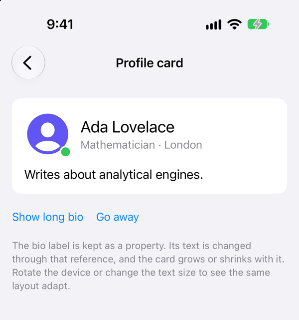
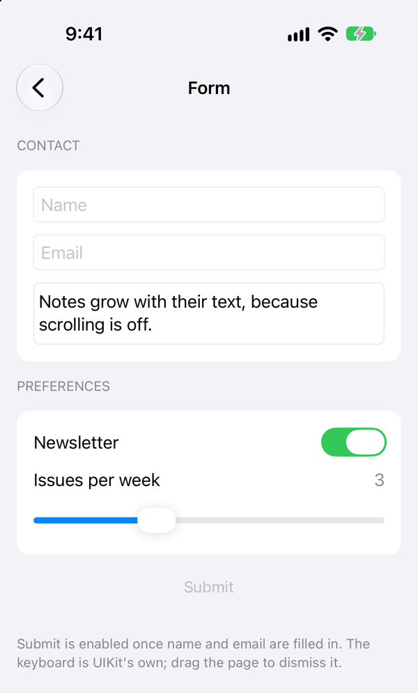
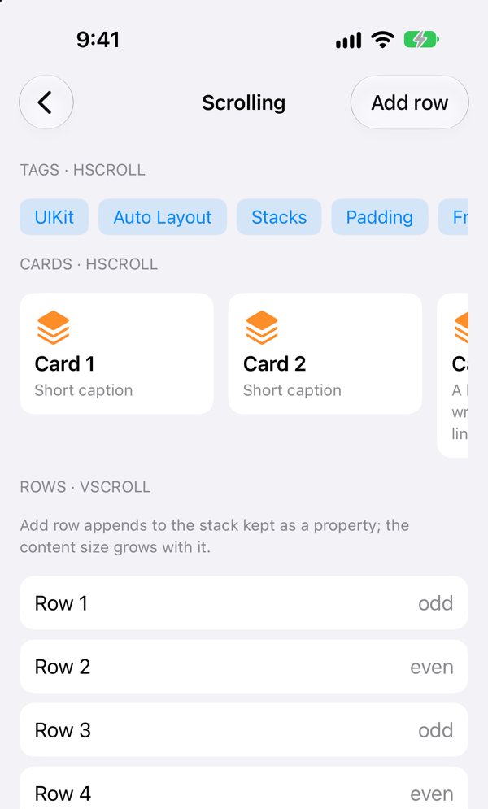

# DeclarativeUIKit

[English](README.md) | [简体中文](README.zh-Hans.md) | **繁體中文**

一個輕量的 UIKit 宣告式版面配置函式庫，以原生 `UIView` 與 Auto Layout 建構，不依賴任何第三方函式庫。

它不引入自訂的繪製層，也不維護平行的視圖階層。你拿到的永遠是真正的 `UIView` 或其子類別，因此能與既有的 UIKit 程式碼自由混用。截圖請見[範例 App](#範例-app)。

資料繫結由搭配的套件 [DeclarativeCombine](https://github.com/nothingsh/DeclarativeCombine) 提供，請見[資料繫結](#資料繫結)。

AppKit 版本請見姊妹套件 [DeclarativeAppKit](https://github.com/nothingsh/DeclarativeAppKit)。

```swift
view.addVStack(alignment: .leading, spacing: 4) {
    UILabel()
        .text("Ada Lovelace")
        .font(textStyle: .headline)
    UILabel()
        .text("Mathematician")
        .font(textStyle: .subheadline)
        .textColor(.secondaryLabel)
}
```

## 目錄

- [安裝](#安裝)
- [用法](#用法)
  - [掛載](#掛載)
  - [Stack](#stack)
  - [屬性 modifier](#屬性-modifier)
  - [Padding 與 frame](#padding-與-frame)
  - [Background 與 overlay](#background-與-overlay)
  - [Spacer](#spacer)
  - [捲動視圖](#捲動視圖)
- [資料繫結](#資料繫結)
- [範例 App](#範例-app)
  - [個人資料卡片](#個人資料卡片)
  - [表單](#表單)
  - [捲動](#捲動)
- [已知限制](#已知限制)
- [開發](#開發)
- [授權條款](#授權條款)

## 安裝

需要 iOS 13.0+ 與 Swift 5.9+。使用 Swift Package Manager 加入：

```swift
dependencies: [
    .package(url: "https://github.com/nothingsh/DeclarativeUIKit.git", from: "0.1.0")
]
```

或在 Xcode 中選擇 File → Add Package Dependencies，輸入 `https://github.com/nothingsh/DeclarativeUIKit`。

## 用法

### 掛載

```swift
view.addContent(page)                          // 填滿父視圖
view.addContent(page, safeArea: .all)          // 保持在安全區域內

view.addVStack(spacing: 8, safeArea: .top) {   // 建構 stack 並掛載
    title
    body
}
```

`addContent` 把視圖的四條邊固定到父視圖，並回傳帶有具體型別的該視圖。`safeArea` 中列出的邊改為固定到父視圖的安全區域。`addHStack`、`addVStack`、`addHScroll` 與 `addVScroll` 把建構與掛載合成一步。

### Stack

```swift
let column = VStack(alignment: .leading, spacing: 4) {
    name
    role
    if isEditing { field }
    for tag in tags { chip(tag) }
    HStack(spacing: 8) {
        icon
        detail
    }
}
```

- `HStack` 與 `VStack` 是 `UIStackView` 的子類別，所有原生 stack API 仍然可用。建構 stack 不會掛載它。
- `alignment` 是交叉軸上的對齊：`VStack` 可用 `leading`、`center`、`trailing` 或 `fill`；`HStack` 可用 `top`、`center`、`bottom`、`firstTextBaseline`、`lastTextBaseline` 或 `fill`。`fill` 會延展每個元素。
- `spacing` 預設為 `0`，因此你看到的間距就是你寫下的間距。之後可以用 `.spacing(_:)`、`.alignment(_:)` 與 `.distribution(_:)` 修改。
- 內容閉包接受視圖、可選視圖、陣列、`if` / `else`、`switch`、`for` 與 `if #available`。

### 屬性 modifier

每個 modifier 設定一個 UIKit 屬性，並以 `Self` 回傳該視圖，因此鏈式呼叫保留具體型別。

```swift
let title = UILabel()
    .text("Title")
    .font(textStyle: .title2)                   // 跟隨 Dynamic Type
    .numberOfLines(0)

let play = UIButton(type: .system)
    .title("Play")
    .title("Pause", for: .selected)

let avatar = UIImageView()
    .image(photo)
    .configure { $0.layer.cornerRadius = 24 }   // 沒有對應 modifier 的屬性
```

| 型別 | Modifier |
| --- | --- |
| `UIView` 及其任何子類別 | `configure`、`alpha`、`isHidden`、`isUserInteractionEnabled`、`contentMode`、`tintColor`、`clipsToBounds`、`accessibilityLabel`、`accessibilityIdentifier` |
| `UILabel` | `text`、`attributedText`、`font`、`font(textStyle:)`、`textColor`、`numberOfLines`、`textAlignment`、`lineBreakMode` |
| `UIImageView` | `image`、`highlightedImage` |
| `UIControl` 及其任何子類別 | `isEnabled`、`isSelected`、`isHighlighted` |
| `UIButton` | `title`、`titleColor`、`image`、`backgroundImage`，皆帶 `for state: UIControl.State = .normal` |
| `UISwitch` | `isOn`、`onTintColor` |
| `UISlider` | `value`、`minimumValue`、`maximumValue`、`minimumTrackTintColor`、`maximumTrackTintColor` |
| `UITextField` | `text`、`attributedText`、`placeholder`、`font`、`font(textStyle:)`、`textColor`、`textAlignment`、`keyboardType`、`returnKeyType`、`isSecureTextEntry` |
| `UITextView` | `text`、`attributedText`、`font`、`font(textStyle:)`、`textColor`、`textAlignment`、`keyboardType`、`returnKeyType`、`isSecureTextEntry`、`isEditable`、`isSelectable`、`isScrollEnabled` |

`font(textStyle:)` 跟隨 Dynamic Type，`font(_:)` 則設定固定字型。按鈕的 modifier 為每個控制項狀態各設定一個值。事件仍使用 UIKit 自己的 target–action 與委派。

### Padding 與 frame

```swift
let card = VStack(alignment: .leading, spacing: 4) {
    name
    role
}
.padding(16)                // 每條邊
.padding(.horizontal, 24)   // 只改指定的邊

stack.padding(horizontal: 16, vertical: 12)
stack.padding(top: 8, leading: 16, bottom: 24, trailing: 12)

let avatar = UIImageView().frame(width: 48, height: 48)
let button = UIButton().frame(minWidth: 88)
let banner = UIImageView().frame(width: 320).frame(aspectRatio: 16 / 9)   // 320 × 180
```

- `padding` 是 stack 的 modifier。它在每條邊上都是固定距離，計入 stack 的尺寸，從不包含安全區域。要給單一視圖加上 padding，把它放進 stack。
- `frame` 給任意視圖加上 required 的尺寸約束。對同一條軸的後一次呼叫會取代前一次。

### Background 與 overlay

```swift
let badge = UILabel().text("New").background(.systemYellow)          // 視圖本身的背景色

let card = VStack { name }
    .padding(16)
    .background { UIView().background(.secondarySystemBackground) }  // stack 後方的任意視圖

// 在視圖前方，並從角上向外偏移
let avatar = UIImageView()
    .frame(width: 48, height: 48)
    .overlay(alignment: .bottomTrailing, offset: CGPoint(x: 4, y: 4)) { statusDot }
```

- `background(_:)` 設定視圖本身的 `backgroundColor`。在 iOS 13 上 stack 不會繪製它，因此請改用 `background { ... }` 給 stack 放一個帶顏色的視圖。
- 視圖形式的裝飾是以約束固定的子視圖；不會插入容器視圖，也沒有 `ZStack`。`alignment` 預設為 `.fill`，也可以是 `.topTrailing` 這樣的位置。
- 被裝飾視圖本身的內容決定其尺寸。
- `offset` 把裝飾從 `alignment` 決定的位置移開：x 正值朝右，y 正值朝下。這個值原樣交給 Auto Layout：在由右至左的版面中，leading 或 trailing 對齊的水平方向會反過來，置中的對齊則不會；如果不希望這樣，請自行調整傳入的值。`.fill` 不接受 offset。

### Spacer

```swift
let header = HStack {
    title.compressionResistancePriority(.defaultLow, for: .horizontal)
    Spacer(minLength: 8)
    badge
}
```

`Spacer` 沿所在 stack 的軸佔據剩餘長度，多個 spacer 平分它。`contentHuggingPriority(_:for:)` 與 `compressionResistancePriority(_:for:)` 決定其他視圖中哪一個先變大或先縮小。

### 捲動視圖

```swift
view.addVScroll(alignment: .fill, spacing: 12) {
    title
    HScroll(spacing: 8, showsIndicators: false) {
        for name in tagNames { chip(name) }
    }
    body
}
.padding(16)
```

- `HScroll` 與 `VScroll` 是 `UIScrollView` 的子類別，以內建的 stack 排列元素，可透過 `stack` 存取。元素決定 content size；在另一條軸上，內容與捲動視圖一致。
- 巢狀放在 stack 中時，`HScroll` 的高度由元素決定，但寬度需要由外部給定，`VScroll` 則相反：像上面那樣使用 `.fill` 對齊，或使用 `frame`。
- `contentInsetAdjustmentBehavior` 為 `.never`，因此內容從捲動視圖的邊緣開始。以 `safeArea` 掛載捲動視圖即可讓它保持在安全區域內。

## 資料繫結

DeclarativeUIKit 只負責版面配置：內容閉包只執行一次，函式庫本身不提供繫結。之後需要變化或回報事件的視圖，必須存成屬性，再手動連接。

[DeclarativeCombine](https://github.com/nothingsh/DeclarativeCombine) 是搭配的套件，用來省掉這一步。它為 UIKit 的控制項、捲動視圖和手勢提供 Combine publisher，並提供一組 modifier，讓視圖在宣告它的地方直接繫結到 publisher：

```swift
view.addVStack(alignment: .fill, spacing: 12) {
    UILabel()
        .font(textStyle: .body)
        .bind(\.text, to: viewModel.$title)

    UIButton(type: .system)
        .title("Submit")
        .bind(\.isEnabled, to: viewModel.$canSubmit)
        .sink(\.tapPublisher) { [weak self] in self?.submit() }
}
```

它是選用的、獨立的套件。DeclarativeUIKit 不依賴它，它也不依賴 DeclarativeUIKit；兩個套件一起加入即可搭配使用。它的範例 App 把下面的[表單](#表單)畫面重寫了一遍，一個視圖都沒有存成屬性。

## 範例 App

`Example/Example.xcodeproj` 是一個以本機 package 方式使用本函式庫的小型 iOS App。在 Xcode 中開啟它，選擇 `Example` scheme 與一個 iOS 模擬器，然後執行。以下的程式碼片段節錄自它的三個畫面。

### 個人資料卡片

程式碼的結構與畫面的結構一致。狀態徽章透過 `overlay` 附加到大頭貼上，不需要包裝視圖，也不需要 `ZStack`。`bio` 與 `status` 都是一般屬性：按鈕直接修改它們，Auto Layout 會調整卡片的大小。不會重建任何視圖。

<table>
<tr>
<td>

```swift
VStack(alignment: .leading, spacing: 12) {
    HStack(spacing: 12) {
        UIImageView()
            .image(UIImage(systemName: "person.crop.circle.fill"))
            .tintColor(.systemIndigo)
            .frame(width: 64, height: 64)
            .overlay(alignment: .bottomTrailing) { status }
        VStack(alignment: .leading, spacing: 2) {
            UILabel()
                .text("Ada Lovelace")
                .font(textStyle: .title2)
            UILabel()
                .text("Mathematician · London")
                .font(textStyle: .subheadline)
                .textColor(.secondaryLabel)
        }
        Spacer()
    }
    bio
}
.card()

// 之後，在按鈕的 action 中：
bio.text(Self.longBio)
status.background(.systemGray)
```

</td>
<td width="300">

</td>
</tr>
</table>

可重複使用的樣式只是一個以 modifier 組成的函式。`card()` 是範例 App 自己的輔助方法，不屬於本函式庫：

```swift
extension UIStackView {
    func card(padding: CGFloat = 16) -> Self {
        self.padding(padding)
            .background {
                UIView()
                    .background(.secondarySystemGroupedBackground)
                    .configure { $0.layer.cornerRadius = 12 }
            }
    }
}
```

### 表單

控制項就是一般的 `UITextField`、`UISwitch` 與 `UISlider`，以 modifier 設定並作為屬性持有。事件使用 UIKit 本身的 target–action 與委派。`Spacer` 把開關與數值推到尾端邊緣。

<table>
<tr>
<td>

```swift
private let newsletter = UISwitch().isOn(true)

private let frequency = UISlider()
    .minimumValue(1)
    .maximumValue(7)
    .value(3)

// 在 viewDidLoad 中：
frequency.addTarget(self, action: #selector(frequencyChanged),
                    for: .valueChanged)

VStack(alignment: .fill, spacing: 12) {
    HStack(spacing: 8) {
        UILabel()
            .text("Newsletter")
            .font(textStyle: .body)
        Spacer()
        newsletter
    }
    HStack(spacing: 8) {
        UILabel()
            .text("Issues per week")
            .font(textStyle: .body)
        Spacer()
        frequencyValue
    }
    frequency
}
.card()
```

</td>
<td width="300">

</td>
</tr>
</table>

### 捲動

`VScroll` 中巢狀放入 `HScroll` 列。內容閉包支援 `for` 迴圈，回傳 `UIView` 的小函式可以像其他視圖一樣組合。點一下 *Add row* 會向作為屬性持有的 stack 追加一列，捲動視圖的 content size 隨之更新。

<table>
<tr>
<td>

```swift
HScroll(spacing: 8, showsIndicators: false) {
    for tag in Self.tags { chip(tag) }
}

HScroll(alignment: .top, spacing: 12) {
    for index in 1...8 { card(index) }
}

rows

private func chip(_ text: String) -> UIView {
    VStack {
        UILabel()
            .text(text)
            .font(textStyle: .subheadline)
            .textColor(.systemBlue)
    }
    .padding(horizontal: 12, vertical: 6)
    .background {
        UIView()
            .background(UIColor.systemBlue.withAlphaComponent(0.12))
            .configure { $0.layer.cornerRadius = 8 }
    }
}
```

</td>
<td width="300">

</td>
</tr>
</table>

所有文字都使用 `font(textStyle:)`，因此各畫面會跟隨動態字體，並能適應旋轉。內容閉包只執行一次；之後的變化透過視圖本身完成，而不是透過資料繫結。

每個畫面都以 `safeArea: .all` 掛載其捲動視圖，因此內容會避開導覽列、主畫面指示條以及橫向時的感測器區域，而畫面的背景顏色仍然鋪滿整個螢幕。

範例 App 的部署目標是 iOS 15.0，這是目前 Xcode 能建置的最低版本；請參閱[已知限制](#已知限制)。

## 已知限制

本 package 宣告的最低版本是 iOS 13，新 API 皆依 iOS 13 的可用性審查過，但從未針對 iOS 13 本身建置或執行過，因為目前的工具鏈已不再支援這個部署目標。目前經過驗證的，是在較新 iOS 版本上的編譯與測試。

## 開發

測試會呼叫 UIKit，必須在 iOS 模擬器中執行；在 macOS 上執行 `swift test` 不是有效的測試方式。

```sh
IOS_SIMULATOR_ID=<simulator UDID> scripts/test-ios.sh
```

使用 `xcrun simctl list devices available` 查詢 UDID。

## 授權條款

[MIT](LICENSE)，Copyright (c) 2026 Wynn.
